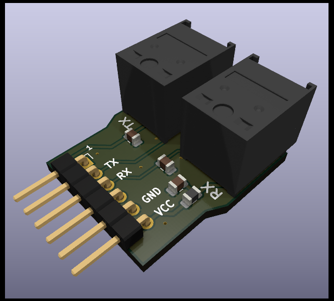

# fiberaudio-pm 

  

A *Pmod&trade; Compatible* peripheral module featuring a pair of active optical audio transmitter/receivers.

  
</picture>

View [**Schematic**](doc/fiberaudio-pm.pdf) &#128196; or [**PCB Preview**](https://htmlpreview.github.io/?https://github.com/islandcontroller/fiberaudio-pm/blob/master/doc/ibom.html) &#127760;.

### Key features

* One pair of active optical audio transmitter/receiver modules (JIS F05, e.g. TOSLINK&trade;)
* One *Digilent Pmod&trade; Compatible* 1x6 pin header
    * Interface Type 1 (GPIO)
* Fully compliant with the [*Digilent Pmod&trade; Interface Specification*, Version 1.3.1](https://digilent.com/reference/_media/reference/pmod/pmod-interface-specification-1_3_1.pdf)

## Overview

The *Pmod&trade; Compatible* fiberaudio-pm peripheral module features a pair of active optical audio transmitter/receiver modules, commonly referred to as "optical S/PDIF". The module allows embedded developers to explore optical data transfer technologies using *Digilent Pmod&trade;* ecosystem components, such as FPGA development boards.

## Review Notes (`Rev.2`)

* CE marking requires compliance with [Directive 2015/863 (EU) amending Annex II to Directive 2011/65/EU](https://eur-lex.europa.eu/legal-content/EN/TXT/?uri=CELEX:32015L0863) (RoHS)
* WEEE marking not required if the board is classified as a 'component' according to [FAQ on Directive 2012/19/EU](https://ec.europa.eu/environment/pdf/waste/weee/faq.pdf) (WEEE)
  * Removed marking in `Rev.3`
* Heat-sinking effect of GND pad thermal spokes is excessive at 400µm width
  * Adjusted to 250µm in `Rev.4`
* "VCC" and "GND" silkscreen placed too close to connector `J1`. Stroke could be a bit wider for better readability.
  * Adjusted position and size in `Rev.4`

## Resources

* [Digilent Pmod&trade; License Agreement](https://digilent.com/reference/_media/pmod/pmod/pmod_license_agreement.pdf)
* Digilent Reference: [Programmable Logic](https://digilent.com/reference/programmable-logic/start)

## Licensing

If not stated otherwise within the specific file, the contents of this project are licensed under the CERN Open Hardware Licence Version 2 - Permissive. The full license text is provided in the [`LICENSE`](LICENSE) document.

    SPDX-License-Identifier: CERN-OHL-P-2.0

This licensing model is compliant with the [Open Source Hardware Definition 1.0](https://www.oshwa.org/definition/).

## Legal Notice

"Digilent" is a registered trademark of *Digilent, Inc*. All other trademarks and registered trademarks mentioned herein are property of their respective owners.